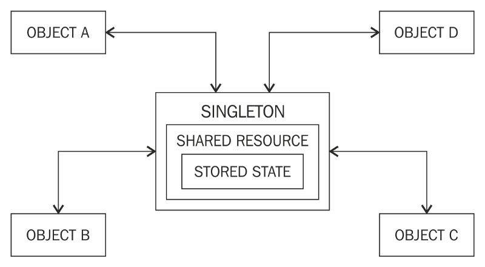
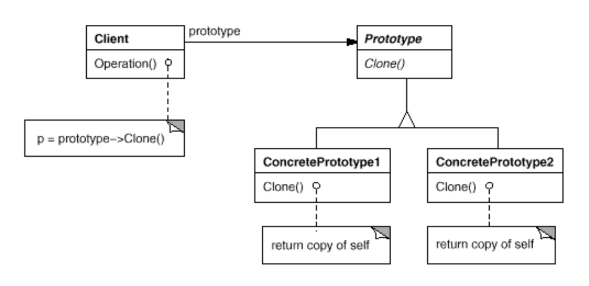

# design-patterns
Advanced Design Patterns in Object Oriented Design for dummies.

## Creational Pattern

### Builder Pattern

A builder pattern encapsulates or hides the process of building a complex object and 
separates the representation of the object and its construction. The separation allows us to construct different 
representations using the same construction process.

### Singleton Pattern

Formally the Singleton pattern is defined as ensuring that only a single instance of a class exists and a global 
point of access to it exists.

### Prototype Pattern

Formally, the pattern is defined as specify the kind of objects to create using a prototypical instance as a 
model and making copies of the prototype to create new objects.

### Factory Method Pattern

Formally, the factory method is defined as providing an interface for object 
creation but delegating the actual instantiation of objects to subclasses.

### Abstract Factory Pattern

Formally, the abstract factory pattern is defined as defining an interface to create 
families of related or dependent objects without specifying their concrete classes.

## Structural Pattern

### Adapter Pattern

Formally, the adapter pattern is defined as allowing incompatible classes to work 
together by converting the interface of one class into another expected by the clients

### Bridge Pattern

Formally, the bridge pattern lets you vary the abstraction independently of the 
implementation, thus decoupling the two in the process.

### Composite Pattern

Formally, the composite pattern is defined as composing objects into tree structures to represent part-whole hierarchies, thus letting clients uniformly treat individual objects and composition of objects.

### Decorator Pattern

The decorator pattern can be thought of as a wrapper or more formally a way to enhance or extend the behavior of an object dynamically

### Facade Pattern

Formally the facade pattern is defined as a single uber interface to one or more subsystems or interfaces intending to make use of the subsystems easier.

### Flyweight

Formally, the pattern is defined as sharing state among many fine-grained objects for efficiency.

## Behavioral Pattern

### Chain of responsability pattern

Formally, the pattern is defined as decoupling the sender of a request from its receiver by chaining the receiving objects together and passing the request along the chain until an object handles it.

### Observer Pattern

The pattern is formally defined as a one to many dependency between objects so that when one object changes state all the dependents are notified.

### Command Pattern

Formally, the pattern is defined as representing an action or a request as an object that can then be passed to other objects as parameters, allowing parameterization of clients with requests or actions. The requests can be queued for later execution or logged. Logging requests enables undo operations.

### Iterator Pattern

 An iterator is formally defined as a pattern that allows traversing the elements of an aggregate or a collection sequentially without exposing the underlying implementation.
 

### Mediator Pattern

Formally, the pattern is defined as encouraging loose coupling among interacting objects by encapsulating their interactions in a mediator object, thus avoiding the need for individual objects to refer to each other directly and allowing to vary object interactions independently.

### Memento Pattern

### Template Method

### Strategy Pattern

### Visitor Pattern

